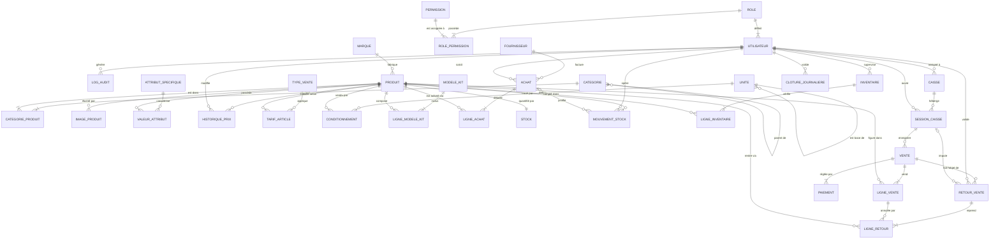

# ARCHITECTURE DE LA BASE DE DONNÉES : LIBRAIRIE NUMÉRIQUE (ERP & POS)

Ce document centralise l'intégralité de l'architecture de la base de données (composée de **36 tables**) propulsant le système d'information de la Librairie Numérique. Il couvre les modules de gestion des utilisateurs (RBAC), du catalogue étendu (avec tarification dynamique, kits et conditionnements), des approvisionnements, des stocks, ainsi que de la gestion de caisse (POS), des retours et de la consolidation financière.

---

## PARTIE 1 : Définition des Processus Métier et Déduction des Entités

### Processus 1 : Sécurité, Audit & Configuration Globale
*   **Scénario :** L'application est protégée par un système de permissions basé sur des rôles (RBAC). Chaque `utilisateur` est assigné à un `role` qui possède un ensemble de `permission`s. Toutes les actions sensibles sont journalisées (`log_audit`). Les alertes sont envoyées via la table `notification`, et les paramètres globaux (TVA, devise, nom) sont stockés dans la `configuration`.
*   **Entités déduites :** `role`, `utilisateur`, `permission`, `role_permission`, `log_audit`, `configuration`, `notification`.

### Processus 2 : Gestion Avancée du Catalogue
*   **Scénario :** Les `produit`s sont classés dans des `categorie`s (système hiérarchique) et associés à une `marque`. Ils peuvent posséder plusieurs images (`image_produit`), des propriétés personnalisées (`attribut_specifique`, `valeur_attribut`) et faire l'objet de modifications de prix traçables pour l'audit (`historique_prix`).
*   **Entités déduites :** `categorie`, `marque`, `produit`, `categorie_produit`, `image_produit`, `attribut_specifique`, `valeur_attribut`, `historique_prix`.

### Processus 3 : Tarification, Conditionnements et Kits
*   **Scénario :** Le prix d'un produit peut varier selon le contexte de vente (`type_vente`, `tarif_article`). Les produits peuvent être vendus à l'unité, ou regroupés dans des cartons/boîtes (`unite`, `conditionnement`). Enfin, des packs promotionnels contenant divers articles peuvent être créés (`modele_kit`, `ligne_modele_kit`).
*   **Entités déduites :** `type_vente`, `tarif_article`, `unite`, `conditionnement`, `modele_kit`, `ligne_modele_kit`.

### Processus 4 : Approvisionnements & Fournisseurs
*   **Scénario :** Le gestionnaire enregistre les commandes d'achat ou factures (`achat`, `ligne_achat`) passées auprès des éditeurs/sociétés (`fournisseur`). À la réception, le système valide les quantités reçues et modifie le stock.
*   **Entités déduites :** `fournisseur`, `achat`, `ligne_achat`.

### Processus 5 : Contrôle des Stocks et Inventaires
*   **Scénario :** Chaque produit est relié à une fiche de `stock` contenant la quantité actuelle et un seuil d'alerte. Toute variation (vente, achat, perte) génère un `mouvement_stock` inaltérable. Des campagnes de vérification peuvent être lancées (`inventaire`, `ligne_inventaire`) pour aligner le stock théorique et le stock réel.
*   **Entités déduites :** `stock`, `mouvement_stock`, `inventaire`, `ligne_inventaire`.

### Processus 6 : Terminal de Caisse (POS), Ventes et Retours
*   **Scénario :** Un caissier ouvre une `session_caisse` sur un terminal (`caisse`) en déclarant son fond initial. Il réalise des transactions (`vente`, `ligne_vente`) réglées par divers moyens (`paiement`). En cas de retour client, il génère un ticket de retour (`retour_vente`, `ligne_retour`) qui remet le produit en stock.
*   **Entités déduites :** `caisse`, `session_caisse`, `vente`, `ligne_vente`, `retour_vente`, `ligne_retour`, `paiement`.

### Processus 7 : Consolidation Financière
*   **Scénario :** En fin de journée, l'administrateur clôture toutes les caisses et valide la journée, générant un rapport figé du chiffre d'affaires, de la TVA et des bénéfices (`cloture_journaliere`).
*   **Entités déduites :** `cloture_journaliere`.

---

## PARTIE 2 : Modèle Conceptuel de Données Exhaustif (MCD - Mermaid)

Le diagramme ci-dessous illustre l'architecture complète des **36 tables** relationnelles définies via Prisma.

---

## PARTIE 3 : Dictionnaire des Données Détaillé (Les 36 Tables)

*(Les types de données et cardinalités correspondent directement au schéma Prisma sous-jacent).*

### 1. Sécurité, Rôles & Traçabilité (RBAC)

| Entité | Champ | Type | Clé | Description |
|---|---|---|---|---|
| **role** | id_role | Int | PK | Identifiant unique du rôle |
| | code_role | String | UK | Code système (ex: ADMIN, CAISSIER) |
| | libelle | String | - | Nom complet affiché |
| **utilisateur** | id_utilisateur | Int | PK | ID interne de l'employé |
| | id_role | Int | FK | Référence vers `role` |
| | nom / prenom | String | - | Identité de l'employé |
| | email | String | UK | Identifiant de connexion |
| | mot_de_passe_hash | String | - | Empreinte sécurisée du mot de passe |
| | statut | Enum | - | ACTIF ou INACTIF |
| **permission** | id_permission | Int | PK | Identifiant de la permission |
| | code_permission | String | UK | Droit spécifique (ex: VENTE_DELETE) |
| | module | String | - | Module concerné (ex: CATALOGUE) |
| **role_permission**| id_role / id_permission | Int | PK/FK | Table de jointure (Rôle <-> Permission) |
| **log_audit** | id_log | BigInt| PK | Identifiant du journal d'audit |
| | id_utilisateur | Int | FK | Auteur de l'action |
| | action / entite | String| - | Ce qui a été fait et sur quoi |
| | details_json | Json | - | Détail des changements (avant/après) |

### 2. Configuration Globale & Notifications

| Entité | Champ | Type | Clé | Description |
|---|---|---|---|---|
| **configuration** | id_configuration | Int | PK | Identifiant (généralement 1) |
| | nom_librairie | String| - | Nom de l'établissement |
| | tva / devise | Decimal| - | Paramètres financiers globaux |
| **notification** | id_notification | Int | PK | Identifiant de l'alerte système |
| | type / titre | String| - | Niveau (alerte, info) et sujet |
| | message / lue | String| - | Contenu et statut de lecture |

### 3. Catalogue de Produits

| Entité | Champ | Type | Clé | Description |
|---|---|---|---|---|
| **categorie** | id_categorie | Int | PK | Identifiant de la catégorie |
| | nom / slug | String | - | Libellé et chemin d'URL |
| | id_categorie_parente| Int | FK | Pour l'arborescence (récursif) |
| **marque** | id_marque | Int | PK | Identifiant de la marque/éditeur |
| | nom | String | UK | Nom de l'éditeur ou fabriquant |
| **produit** | id_produit | Int | PK | Identifiant unique de l'article |
| | reference | String | UK | SKU interne |
| | code_barre | String | UK | EAN/UPC pour le lecteur douchette |
| | libelle / description| String | - | Titre de l'ouvrage ou produit |
| | id_marque | Int | FK | Éditeur rattaché |
| | prix_achat / vente | Decimal| - | Tarifs de base par défaut |
| | etat | Enum | - | NEUF, OCCASION, RECONDITIONNE |
| **cat_produit** | id_produit / id_cat | Int | PK/FK| Table de jointure produit-catégorie |
| **image_produit** | id_image | Int | PK | ID de la photo |
| | id_produit | Int | FK | Produit illustré |
| | url_image / est_princ| String| - | Chemin de l'image et statut de couverture |
| **attribut_spec** | id_attribut | Int | PK | ID de la propriété (ex: ISBN, Auteur) |
| | code_attribut | String | UK | Code système (ex: `isbn`) |
| **valeur_attribut**| id_produit / id_attr | Int | PK/FK| Table de jointure produit-attribut |
| | valeur | Text | - | Contenu exact (ex: "978-2-04...") |
| **historique_prix**| id_historique | Int | PK | ID de la trace tarifaire |
| | id_produit / id_user| Int | FK | Produit impacté et auteur |
| | ancien / nouveau_prix| Decimal| - | Traces des anciens et nouveaux prix |

### 4. Tarification, Unités & Kits

| Entité | Champ | Type | Clé | Description |
|---|---|---|---|---|
| **type_vente** | id_type_vente | Int | PK | Catégorie de prix (ex: Gros, Détail) |
| **tarif_article** | id_tarif | Int | PK | Règle de tarification |
| | id_produit / id_type| Int | FK | Produit et Type de vente associés |
| | prix | Decimal| - | Prix applicable |
| **unite** | id_unite | Int | PK | Ex: Carton, Pack de 10 |
| | multiple | Int | - | Coefficient par rapport à l'unité de base |
| **conditionnement**| id_conditionnement | Int | PK | Règle d'emballage |
| | id_produit / id_unite| Int | FK | Article et Unité appliqués |
| | prix_vente | Decimal| - | Prix pour ce conditionnement |
| **modele_kit** | id_modele_kit | Int | PK | Identifiant du pack promotionnel |
| | nom_kit / prix | String | - | Nom et tarif forfaitaire du bundle |
| **ligne_modele_kit**| id_ligne_modele_kit| Int | PK | Article inclus dans le kit |
| | id_kit / id_produit | Int | FK | Références kit et produit |

### 5. Approvisionnements & Achats

| Entité | Champ | Type | Clé | Description |
|---|---|---|---|---|
| **fournisseur** | id_fournisseur | Int | PK | ID du distributeur |
| | nom_entreprise | String | - | Raison sociale |
| | email / telephone | String | - | Contacts |
| **achat** | id_achat | Int | PK | Bon de commande / facture d'entrée |
| | numero_facture | String | - | Référence donnée par l'éditeur |
| | id_fournisseur / user| Int | FK | Distributeur et Employé |
| | montant_total_ttc | Decimal| - | Valeur totale du bon |
| | statut_achat | Enum | - | EN_ATTENTE, RECU, ANNULE |
| **ligne_achat** | id_ligne_achat | Int | PK | Ligne du bon d'entrée |
| | id_achat / id_produit| Int | FK | Bon parent et Livre acheté |
| | quantite_recue | Int | - | Quantité validée entrant en stock |

### 6. Stocks & Inventaires

| Entité | Champ | Type | Clé | Description |
|---|---|---|---|---|
| **stock** | id_stock | Int | PK | Identifiant du registre |
| | id_produit | Int | FK/UK| Produit concerné (Relation 1:1) |
| | quantite_en_stock | Int | - | Niveau physique réel actuel |
| | seuil_alerte | Int | - | Quantité minimum avant réassort |
| **mouvement_stock**| id_mouvement | Int | PK | ID de la trace de stock |
| | id_produit / id_user| Int | FK | Produit modifié et Auteur |
| | type_mouvement | Enum | - | Ex: SORTIE_VENTE, ENTREE_ACHAT |
| | quantite | Int | - | Valeur de variation (+ ou -) |
| **inventaire** | id_inventaire | Int | PK | ID de la campagne de comptage |
| | statut_inventaire | Enum | - | EN_COURS, VALIDE, ANNULE |
| **ligne_inventaire**| id_ligne_inventaire| Int | PK | Ligne de contrôle |
| | id_inventaire / prod | Int | FK | Inventaire parent et Produit ciblé |
| | qte_theorique / reelle| Int | - | Ce que dit le PC vs Ce qui a été compté |

### 7. POS, Caisse, Ventes & Retours

| Entité | Champ | Type | Clé | Description |
|---|---|---|---|---|
| **caisse** | id_caisse | Int | PK | Poste de caisse physique |
| | code_caisse / statut| String | - | Identifiant (Caisse-01) et Statut (OUVERTE) |
| **session_caisse** | id_session | Int | PK | Service de caisse d'un employé |
| | id_caisse / id_user | Int | FK | Poste concerné et Caissier en charge |
| | fond_de_caisse_initial| Decimal| - | Monnaie dans le tiroir à l'ouverture |
| | ecart_caisse | Decimal| - | Différence lors de la clôture |
| **vente** | id_vente | Int | PK | ID de la transaction POS ou Web |
| | reference_ticket | String | UK | Numéro de reçu client |
| | id_session | Int | FK | Session rattachée |
| | total_ttc / marge | Decimal| - | Totaux et bénéfice calculé |
| | statut_vente | Enum | - | VALIDEE, ANNULEE, REMBOURSEE |
| **ligne_vente** | id_ligne_vente | Int | PK | Article vendu |
| | id_vente / id_produit| Int | FK | Ticket parent et Produit |
| | quantite | Int | - | Quantité vendue |
| | prix_unitaire_snapshot| Decimal| - | Prix exact au moment de l'achat (figé) |
| **paiement** | id_paiement | Int | PK | Un des règlements du ticket |
| | id_vente | Int | FK | Ticket parent |
| | mode_paiement | Enum | - | ESPECES, CB, MOBILE_MONEY |
| **retour_vente** | id_retour_vente | Int | PK | Ticket de retour client |
| | id_vente / id_user | Int | FK | Ticket d'origine et Agent validant |
| | motif | String | - | Raison du retour |
| **ligne_retour** | id_ligne_retour | Int | PK | Produit rapporté par le client |
| | id_retour / id_ligne | Int | FK | Retour parent et Ligne_Vente d'origine |

### 8. Consolidation Financière

| Entité | Champ | Type | Clé | Description |
|---|---|---|---|---|
| **cloture_journaliere**| id_cloture | Int | PK | ID du rapport de fin de journée |
| | date_cloture | Date | UK | Date de la journée validée |
| | chiffre_affaires_ttc | Decimal| - | Somme totale encaissée le jour J |
| | benefice_brut_total | Decimal| - | Marge bénéficiaire cumulée du jour J |
| | nombre_ventes | Int | - | Nombre total de tickets générés |
| | id_utilisateur_valid| Int | FK | Administrateur ayant validé la journée |
